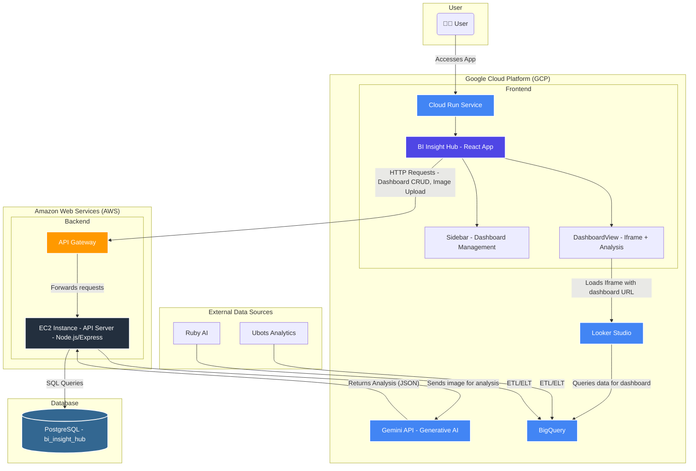

Of course, here is a comprehensive markdown documentation for the provided architecture.

# BI Insight Hub - Architecture Documentation

## 1\. Introduction

Welcome to the architectural documentation for the **BI Insight Hub**. This document outlines the technical architecture of the application, a powerful tool for visualizing BI dashboards, generating AI-driven insights, and automating data analysis.

The system is built on a **multi-cloud architecture**, leveraging the strengths of both **Google Cloud Platform (GCP)** for frontend hosting and data services, and **Amazon Web Services (AWS)** for secure backend processing. This design ensures scalability, security, and high performance.

-----

## 2\. Architecture Diagram

The following diagram illustrates the key components of the system and their interactions.

-----

## 3\. Core Components

### 3.1. Frontend (Google Cloud Platform) ☁️

The entire user-facing experience is hosted on GCP for scalability and integration with Google's data services.

  * **Cloud Run Service**: The frontend **React App** is deployed on Cloud Run, a serverless platform that automatically scales the application based on traffic.
  * **BI Insight Hub - React App**: The single-page application (SPA) that provides the user interface. It consists of:
      * **Sidebar**: Allows users to add, delete, and switch between different dashboard visualizations.
      * **DashboardView**: The main component that renders the selected dashboard within an `<iframe>` and contains the functionality to capture a screenshot for AI analysis.
  * **Looker Studio**: The BI tool used to create and host the dashboards. The application embeds these dashboards for visualization.
  * **BigQuery**: Acts as the central data warehouse. It stores all the analytical data that Looker Studio queries to build the dashboards.
  * **Gemini API**: Google's generative AI model. It receives dashboard images from our backend and returns structured JSON containing summaries, key insights, and recommendations.

### 3.2. Backend (Amazon Web Services) ⚙️

The backend logic is hosted on AWS to provide a secure and isolated processing environment.

  * **API Gateway**: Serves as the single, secure entry point for all API requests coming from the frontend. It manages traffic, authorization, and routes requests to the backend server.
  * **EC2 Instance**: A virtual server that runs the **Node.js/Express API Server**. This server houses the core application logic, including user request handling, database communication, and orchestration of calls to the Gemini API.

### 3.3. Database 🗄️

  * **PostgreSQL**: A relational database used to store application-specific metadata. The `bi_insight_hub` database contains tables for:
      * **Visualizations**: Stores information about the configured dashboards (e.g., name, Looker Studio URL).
      * **Insights**: Stores the historical AI-generated insights for each dashboard.

### 3.4. External Data Sources 📊

  * **Ubots Analytics & Ruby AI**: These represent the primary data sources that feed into our data ecosystem. Data from these systems is ingested into **BigQuery** through ETL/ELT (Extract, Transform, Load / Extract, Load, Transform) pipelines.

-----

## 4\. Architectural Flows

### 4.1. Viewing a Dashboard

1.  The **User** accesses the application URL, served by **Cloud Run**.
2.  The **React App** sends an HTTP request via the **API Gateway** to fetch the list of available dashboards.
3.  The **EC2 Server** queries the **PostgreSQL DB** and returns the dashboard list.
4.  The user selects a dashboard. The app then renders an `<iframe>` pointing to the dashboard's URL on **Looker Studio**.
5.  **Looker Studio** queries **BigQuery** to populate the dashboard with data.

### 4.2. Generating AI Insights

1.  The user initiates the "Analyze" function in the **DashboardView**.
2.  The **React App** captures a screenshot of the `<iframe>` content and sends it as a base64 encoded image to the backend via the **API Gateway**.
3.  The **EC2 Server** receives the image and sends it to the **Gemini API** for analysis.
4.  **Gemini** processes the image and returns a JSON object containing `summary`, `key_insights`, and `recommendations`.
5.  The **EC2 Server** saves this structured data in the **PostgreSQL DB**, linking it to the specific dashboard.
6.  The result is sent back to the frontend and displayed to the user.